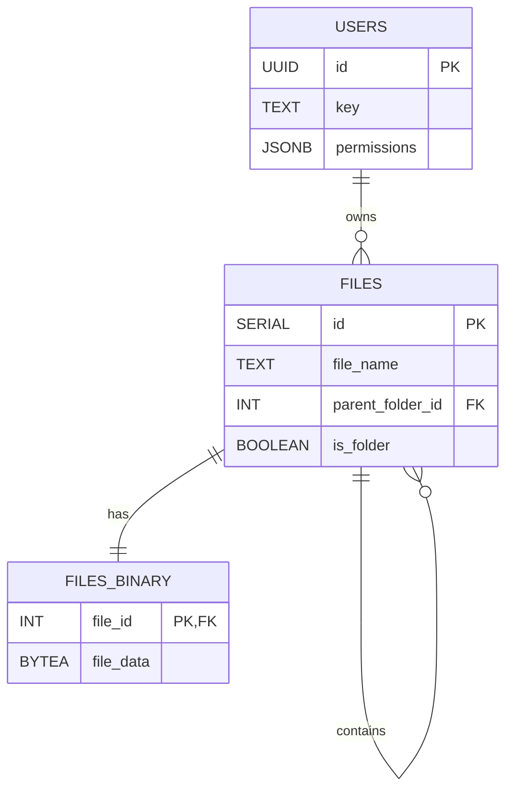

# MiniStash

A **Mini Stash** for all your files

### How it works

DB schema



### How to set up

##### Supabase

run this:

```sql
CREATE TABLE users (
    id UUID PRIMARY KEY DEFAULT gen_random_uuid(),
    key TEXT NOT NULL,
    permissions JSONB
);

CREATE TABLE files (
    id SERIAL PRIMARY KEY,
    file_name TEXT NOT NULL,
    parent_folder_id INT REFERENCES files(id) ON DELETE CASCADE,
    is_folder BOOLEAN DEFAULT FALSE
);

-- Only files (not folders) have binary data
CREATE TABLE files_binary (
    file_id INT PRIMARY KEY REFERENCES files(id) ON DELETE CASCADE,
    file_data BYTEA NOT NULL
);

```
