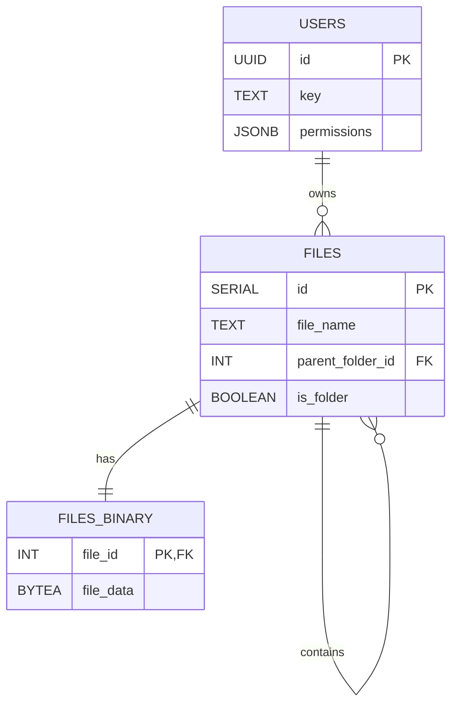

# MiniStash

A **Mini Stash** for all your files

### How it works

DB schema



### How to set up

##### Supabase

run this:

```sql
CREATE TABLE files (
    id SERIAL PRIMARY KEY,
    user_id UUID REFERENCES users(id),
    file_name TEXT,
    file_data BYTEA
);
```
